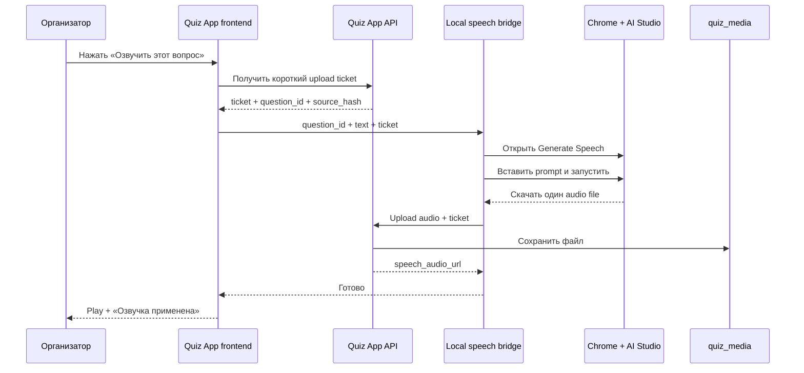

# MVP-план озвучки одного вопроса через парсинг Google AI Studio

> Проект: «Свои знают»
> Цель MVP: в редакторе выбрать один вопрос и нажать «Озвучить». После этого система сама запускает локальный bridge и отдельный Chrome, открывает уже авторизованный Google AI Studio, вставляет текст, генерирует, скачивает и применяет аудио к вопросу.
>
> Массовой генерации, очередей и Gemini API на этом этапе нет. Официальный API подключается позже вместо браузерного адаптера.

> **Проверка интерфейса 2026-08-03:** надпись `No API key selected` не блокирует `Run` сама по себе — на текущем аккаунте ручной запуск успешно создал WAV. MVP управляет только браузерным интерфейсом, не вызывает Gemini API, не создаёт ключи и не включает billing. Повторные запуски сейчас получают от Google HTTP 403, поэтому автоматический end-to-end smoke ещё не закрыт.

## 1. Что делаем в MVP

Полный пользовательский сценарий:

Первоначальная настройка выполняется один раз: система запускает отдельный Chrome profile, а пользователь вручную проходит Google-вход. Пароль и cookie приложение не копирует — Google session остаётся внутри выделенного profile. Если сам Google после `Run` покажет отдельный dialog настройки ключа или billing, это ручное действие пользователя, но одна надпись `No API key selected` не считается таким dialog.

После первоначальной настройки полный рабочий цикл автоматический:

1. Пользователь открывает редактор конкретного вопроса.
2. Нажимает «Озвучить через AI Studio».
3. Frontend обращается к local bridge; если его нет, desktop launcher запускает bridge автоматически.
4. Bridge проверяет CDP; если отдельный Chrome не запущен, запускает его сам.
5. Chrome открывается с сохранённым profile, в котором уже есть Google session.
6. Browser automation открывает `https://aistudio.google.com/generate-speech`.
7. Находит рабочую область через актуальный browser snapshot.
8. Вставляет инструкцию и текст вопроса.
9. Запускает генерацию.
10. Ждёт полного завершения генерации: новый аудиоисточник, ненулевая длительность, `readyState = 4`, активный `Download` и стабильная сигнатура в двух проверках подряд.
11. Получает готовый аудиофайл из браузерного `data:`/`blob:` источника в отдельный каталог задачи.
12. Проверяет сохранённый файл.
13. Загружает его в Quiz App для исходного `question_id`.
14. Backend сохраняет файл в `quiz_media`.
15. Frontend показывает готовый результат.
16. Телевизионный экран использует сохранённую озвучку.

Каждое нажатие обрабатывает ровно один вопрос. Параллельные задачи запрещены.

## 2. Что не входит в MVP

- массовая генерация всего квиза;
- background queue;
- автоматический ввод Google email, пароля, 2FA или CAPTCHA;
- ввод пароля, обработка 2FA или CAPTCHA;
- работа из телефона организатора;
- запуск browser automation внутри Docker-контейнера;
- прямые вызовы Gemini API из Quiz App или bridge;
- автоматическое создание/чтение API key и автоматическое подключение billing;
- streaming;
- несколько голосов в одном вопросе;
- генерация на лету во время игры.

## 3. Почему нужен локальный bridge

Quiz App работает в Docker, а Google Chrome и Google-аккаунт находятся в Windows. API-контейнер не должен получать доступ к browser profile пользователя.

Поэтому добавляется маленький локальный процесс:

```text
tools/ai-studio-speech-bridge/
```

Он запускается только на ноутбуке организатора и слушает только:

```text
http://127.0.0.1:8766
```

Frontend на том же ноутбуке отправляет ему одну задачу. Bridge сам поднимает отдельный Chrome через CDP, использует сохранённую авторизованную сессию и после скачивания передаёт файл в обычный backend Quiz App.

Обычная веб-страница не имеет права запускать Windows-процессы. Поэтому для настоящего «нажал и всё само запустилось» нужен один из двух механизмов:

1. **MVP-рекомендация:** `start-quiz-mvp.ps1` одновременно запускает Docker Compose и bridge, а Chrome bridge запускает лениво при первом вопросе.
2. **После демо:** зарегистрировать current-user startup task для bridge или собственный URL protocol `quiz-speech://`, который запускает bridge по кнопке.

Для первого показа достаточно единого launcher-файла: пользователь запускает проект одной командой, а дальнейшая генерация полностью автоматическая.

## 4. Схема MVP



## 5. Browser automation

### 5.1 Инструмент

Использовать `agent-browser`, подключённый к существующему Chrome по CDP. Не писать отдельный самодельный Playwright-драйвер для Google AI Studio.

На текущей машине `agent-browser 0.33.2` и его Chrome runtime уже установлены. Для чистой машины первоначальная установка:

```powershell
npm i -g agent-browser
agent-browser install
```

### 5.2 Отдельный постоянный Chrome profile

Не использовать основной browser profile. Создать отдельный постоянный каталог:

```text
C:\Users\<user>\AppData\Local\QuizApp\ai-studio-profile
```

При первой настройке Chrome запускается видимым, чтобы пользователь самостоятельно выполнил Google-вход. При последующих генерациях bridge запускает тот же profile автоматически; окно можно открыть свёрнутым, но не полностью скрытым, чтобы пользователь мог увидеть Google security check:

```powershell
$chromePath = "C:\Program Files\Google\Chrome\Application\chrome.exe"
$profilePath = "$env:LOCALAPPDATA\QuizApp\ai-studio-profile"

Start-Process -FilePath $chromePath -ArgumentList @(
  "--remote-debugging-port=9223",
  "--user-data-dir=$profilePath",
  "--start-minimized",
  "--no-first-run",
  "--no-default-browser-check"
)
```

Если Chrome установлен в другом месте, startup script должен найти его через известные Windows paths и registry, а не требовать редактирования исходного кода.

Bridge не хранит email или пароль. Автоматический вход получается за счёт Google cookie/session, которые Chrome сам хранит внутри этого profile. Если Google завершит сессию, единственный допустимый сценарий — показать Chrome и попросить пользователя повторно войти.

### 5.3 Автоматический bootstrap

Добавить `start-quiz-mvp.ps1`, который:

1. проверяет наличие `agent-browser`;
2. запускает bridge как фоновый helper с `-WindowStyle Hidden`;
3. ожидает `http://127.0.0.1:8766/health`;
4. запускает Docker Compose, если он ещё не запущен;
5. открывает `/admin` в обычном браузере;
6. не запускает AI Studio до первого запроса на озвучку.

При `/generate-one` bridge выполняет lazy startup:

1. проверяет `http://127.0.0.1:9223/json/version`;
2. если CDP отсутствует, запускает отдельный Chrome;
3. ожидает `webSocketDebuggerUrl` с ограниченным polling;
4. выполняет `agent-browser connect`;
5. только после успешного connect выполняет `open`.

Если bridge неожиданно остановился после запуска проекта, frontend может предложить один клик по зарегистрированному `quiz-speech://start`. Для самого первого MVP допустимо показать команду повторного запуска общего launcher, потому что обычный HTTP frontend не может безопасно запустить `.ps1` напрямую.

### 5.4 Обязательный порядок команд

```powershell
agent-browser connect http://127.0.0.1:9223
agent-browser open https://aistudio.google.com/generate-speech
agent-browser get title
agent-browser get url
agent-browser snapshot
```

Сначала `connect`, затем `open`. Bridge не должен позволять CLI автоматически запускать неизвестный Chrome profile.

### 5.5 Работа с интерфейсом

AI Studio нельзя парсить по одному заранее записанному CSS-селектору. Алгоритм:

1. открыть Speech URL;
2. получить snapshot;
3. убедиться, что это `aistudio.google.com`;
4. проверить видимый текст Speech/TTS playground;
5. определить input/textarea и кнопки по актуальным refs из snapshot;
6. выбрать ref;
7. вставить prompt;
8. снова получить snapshot;
9. найти Generate/Run;
10. нажать;
11. ожидать полное завершение генерации;
12. повторно получить snapshot;
13. найти доступное действие Download и проверить, что оно активно;
14. убедиться, что новый audio source имеет ненулевую длительность, `readyState = 4` и стабилен в двух последовательных проверках;
15. сохранить готовый `data:`/`blob:` источник в каталог задачи.

После навигации или изменения страницы старые refs считаются недействительными.

### 5.6 Проверка состояния аккаунта

Bridge только определяет состояния:

- `ready` — пользователь уже вошёл, playground доступен;
- `login_required` — сохранённая Google session истекла; открыть Chrome и один раз войти вручную;
- `captcha_or_security_check` — остановиться и показать инструкцию;
- `page_changed` — ожидаемые элементы не найдены;
- `generation_busy` — уже выполняется другая задача;
- `download_unavailable` — полное аудио создано, но его браузерный источник нельзя сохранить.
- `api_key_required` — после `Run` действительно открылся dialog выбора/создания ключа; одна надпись `No API key selected` не вызывает эту ошибку.
- `generation_forbidden` — Google вернул HTTP 403 после `Run`; служебный `trivia.wav` не принимать как результат.

Bridge не вводит email/пароль, не создаёт и не читает API key, не включает billing, не кликает CAPTCHA и не обходит Google security screens.

## 6. Голос, тон и эффекты

Пользователь не должен вручную писать длинную инструкцию Google. В Quiz App создаётся визуальный конструктор, который собирает prompt автоматически.

### 6.1 Выбор голоса

В интерфейсе показываются:

- фильтр `Женские` / `Мужские` / `Все`;
- список проверенных голосов с понятными названиями;
- краткое описание: мягкий, глубокий, энергичный, спокойный;
- кнопка короткого preview;
- сохранённый голос по умолчанию для текущего квиза;
- необязательное переопределение для отдельного вопроса.

Google использует собственные имена голосов. Приложение хранит curated-каталог:

```json
{
  "id": "google-voice-name",
  "label": "Мужской · энергичный ведущий",
  "presentation": "male",
  "description": "Уверенный и яркий голос для обычных раундов",
  "enabled": true
}
```

Пол `male`/`female` используется только как удобный фильтр интерфейса. Перед включением конкретного голоса его звучание нужно вручную проверить в AI Studio. Parser выбирает голос по точному Google voice name; если голос исчез, он останавливается и не подставляет другой молча.

### 6.2 Ползунки

| Настройка | UI | Как превращается в prompt |
|---|---|---|
| Темп | `Медленно 0—100 Быстро` | Медленный / средний / быстрый темп по диапазонам |
| Энергия | `Спокойно 0—100 Энергично` | Calm / balanced / energetic delivery |
| Высота | `Низко 0—100 Высоко` | Low / natural / higher vocal register |
| Выразительность | `Сдержанно 0—100 Театрально` | Neutral / expressive / theatrical |
| Чёткость | `Обычно 0—100 Максимально чётко` | Clear diction, emphasize question wording |
| Пауза | `0—1500 мс` | Short/medium/dramatic pause before transcript |

Это смысловые настройки, а не гарантированная цифровая обработка WAV: parser переводит их в естественную инструкцию для генеративной модели.

### 6.3 Чекбоксы и эффекты

- `Телевизионный ведущий` — базовая манера quiz show host;
- `С лёгкой улыбкой` — тёплая дружелюбная подача;
- `Добавить интригу` — suspense перед ключевой частью;
- `Драматическая пауза` — пауза перед самим вопросом;
- `Подчеркнуть важные слова` — умеренное смысловое ударение;
- `Таинственный тон` — более тихая загадочная подача;
- `Финальный вопрос` — высокая значимость без крика;
- `Без добавления слов` — всегда включено и недоступно для отключения.

Не следует добавлять эффект эха, реверберации или изменение скорости после скачивания в MVP. Если Google не воспроизвёл желаемый эффект, пользователь нажимает «Переозвучить» с другими настройками.

### 6.4 Готовые пресеты

- `Классический ведущий`;
- `Энергичный баттл`;
- `Спокойный семейный`;
- `Таинственный раунд`;
- `Финальный вопрос`;
- `Свои настройки`.

Выбор preset только заполняет голос, ползунки и чекбоксы. После этого каждое значение можно изменить.

### 6.5 Детерминированный prompt builder

Frontend отправляет структурированные настройки, а итоговый prompt строит bridge по версионированному шаблону. HTML или готовая browser-команда с frontend не принимаются.

Пример результата:

```text
Создай озвучку на русском языке.
Манера: уверенный ведущий телевизионной викторины, дружелюбный и энергичный.
Темп средний. Регистр голоса естественный. Выразительность умеренно театральная.
Дикция максимально чёткая. Добавь короткую драматическую паузу перед вопросом.
Не добавляй вступление, пояснения, комментарии или новые слова.
Произнеси только текст между маркерами.

ТЕКСТ ВОПРОСА:
<<<
{question_text}
>>>
```

Перед вставкой:

- удалить управляющие символы;
- нормализовать переводы строк;
- ограничить длину, например 1 000 символов;
- не интерпретировать текст вопроса как browser command;
- провалидировать enum и диапазоны всех настроек;
- сохранить `settings_json`;
- вычислить `source_hash` из текста, голоса, настроек и версии prompt builder.

Если `source_hash` совпадает с активной сохранённой версией, UI показывает «Озвучка уже готова» и не запускает Google повторно без явного нажатия «Всё равно переозвучить».

## 7. Контроль скачивания

Для каждой задачи создаётся отдельная временная папка:

```text
%LOCALAPPDATA%\QuizApp\speech-downloads\{task_id}\
```

Перед генерацией она должна быть пустой.

Bridge принимает только один новый файл, сохранённый после полного завершения генерации из browser `data:`/`blob:` source:

- не принимает старый источник, существовавший до `Run`;
- ждёт `readyState = 4`, активный `Download` и стабильную сигнатуру результата;
- разрешает только WAV/MP3/M4A/OGG;
- проверяет magic bytes, а не только расширение;
- отклоняет пустой или чрезмерно большой файл;
- переименовывает в безопасное имя внутри temp directory;
- после успешного upload удаляет временный файл;
- при ошибке сохраняет его до ручного повторения/очистки.

Нельзя искать «последний аудиофайл» во всей папке Downloads пользователя: так легко применить не тот файл к вопросу. Runner сохраняет только источник `<audio>` текущей вкладки после подтверждённого полного завершения.

## 8. Сохранение и версии озвучки

Да, готовая озвучка сохраняется постоянно:

- аудиофайл — в существующем Docker volume `quiz_media`;
- связь с вопросом и настройки — в PostgreSQL;
- при открытии вопроса Google повторно не вызывается;
- файл продолжает работать после перезагрузки страницы и контейнеров;
- для backup нужно сохранять и PostgreSQL, и `quiz_media`.

Так как нужна безопасная переозвучка, вместо одного набора полей в `Question` использовать таблицу `question_speech_versions`.

| Поле | Назначение |
|---|---|
| `id` | UUID версии |
| `question_id` | Владелец озвучки |
| `version_number` | 1, 2, 3… |
| `status` | `candidate`, `active`, `previous`, `discarded` |
| `file_url` | URL сохранённого файла |
| `mime_type` | MIME-type |
| `source_text` | Текст на момент генерации |
| `source_hash` | Hash текста + голоса + настроек + prompt version |
| `voice_id` | Точное имя голоса AI Studio |
| `voice_presentation` | `male` или `female` для UI-фильтра |
| `settings_json` | Ползунки, эффекты и выбранный preset |
| `prompt_version` | Версия локального prompt builder |
| `source` | `ai_studio_browser_mvp` или `manual` |
| `created_at` | Время генерации |
| `activated_at` | Время применения |

Создать Alembic-миграцию:

```text
0007_question_speech_versions.py
0008_repair_legacy_speech_settings.py
```

`0008` исправляет существующие локальные БД, где ранний `create_all` успел создать колонку `settings` до появления канонического имени `settings_json`.

### 8.1 Повторное использование

При обычном показе сервер выбирает только `status=active`. Он не обращается к AI Studio.

Если text/settings hash совпадает с активной версией:

- основная кнопка показывает `Озвучка сохранена`;
- доступно прослушивание и повтор;
- Google не открывается;
- явная кнопка `Переозвучить` всё равно может создать новую candidate.

### 8.2 Безопасная переозвучка

Если у вопроса ещё нет active-версии, первый успешно проверенный файл автоматически становится active: пользователь сразу получает готовую озвучку без дополнительного действия.

При переозвучке:

1. Текущая active-версия остаётся рабочей.
2. Parser создаёт новый файл со статусом `candidate`.
3. Пользователь прослушивает candidate.
4. Доступны кнопки:
   - `Применить новую`;
   - `Переозвучить ещё раз`;
   - `Оставить старую`.
5. Только после `Применить новую` backend транзакционно делает candidate активной, а старую — previous.
6. При ошибке генерации текущая active-версия не меняется.

Для MVP хранить active, одну previous и одну candidate. Более старые discarded-файлы удалять после безопасной проверки пути. Это позволяет быстро вернуть предыдущий вариант, но не раздувает media volume.

### 8.3 Настройки по умолчанию

У события хранится `speech_settings` JSON с выбранным голосом и стилем по умолчанию. Вопрос может:

- использовать настройки квиза;
- иметь собственное переопределение;
- вернуться к настройкам квиза.

Изменение event defaults не удаляет существующие файлы. UI помечает несовпадающие версии как `Настройки изменились` и предлагает переозвучить только по явному нажатию.

### Почему нельзя использовать `media_url`

`media_url` уже хранит фотографию или аудиофрагмент самого задания. Вопрос должен уметь одновременно иметь:

- изображение/музыкальный фрагмент;
- отдельный голос, читающий текст вопроса.

## 9. Backend endpoints

### 9.1 Короткий ticket

```http
POST /api/questions/{question_id}/speech/automation-ticket
Authorization: Bearer <admin_token>
```

Ответ:

```json
{
  "question_id": "uuid",
  "text": "Текст вопроса",
  "source_hash": "sha256",
  "voice_id": "google-voice-name",
  "settings": {
    "preset": "classic-host",
    "pace": 50,
    "energy": 70,
    "pitch": 50,
    "expression": 60,
    "clarity": 90,
    "pause_ms": 300,
    "effects": ["warm-smile"]
  },
  "ticket": "short-lived-signed-token",
  "expires_in_seconds": 600
}
```

Ticket подписывается существующим `SECRET_KEY` и содержит:

- `question_id`;
- `source_hash`;
- `exp`;
- случайный nonce.

Он не даёт доступ к остальным organizer endpoints.

### 9.2 Загрузка candidate

```http
POST /api/questions/{question_id}/speech/upload
X-Speech-Automation-Ticket: <ticket>
Content-Type: multipart/form-data
```

Backend:

1. проверяет подпись и срок ticket;
2. повторно читает Question;
3. убеждается, что текст, голос и настройки всё ещё имеют тот же `source_hash`;
4. проверяет audio type/size/signature;
5. сохраняет файл в media volume;
6. создаёт `QuestionSpeechVersion`;
7. если active ещё нет, сразу назначает новую версию active;
8. если active уже есть, сохраняет новую версию как candidate и не меняет текущую;
9. возвращает active/candidate URL для preview.

Если текст или настройки изменились во время генерации, upload получает `409 speech_source_changed`. Неправильная озвучка не должна автоматически привязаться.

### 9.3 Применение и откат

```http
POST /api/questions/{question_id}/speech/versions/{version_id}/activate
Authorization: Bearer <admin_token>
```

Candidate-версия становится active только после прослушивания и явного подтверждения. Исключение — самая первая озвучка вопроса: при отсутствии active она применяется автоматически после проверки файла.

```http
POST /api/questions/{question_id}/speech/versions/{version_id}/restore
Authorization: Bearer <admin_token>
```

Позволяет вернуть сохранённую previous-версию без повторной генерации Google.

### 9.4 Удаление

```http
DELETE /api/questions/{question_id}/speech/versions/{version_id}
Authorization: Bearer <admin_token>
```

Удаляется только выбранная версия и её speech-файл, после проверки, что resolved path находится внутри `MEDIA_DIR/speech/`. Активную версию нельзя удалить без подтверждения или предварительного выбора другой версии.

## 10. Локальный bridge API

Bridge слушает только `127.0.0.1:8766`.

### Проверка

```http
GET /health
```

Пример:

```json
{
  "status": "ready",
  "chrome": "connected",
  "ai_studio": "authenticated",
  "busy": false
}
```

### Создание одного файла

```http
POST /generate-one
Origin: http://localhost
Content-Type: application/json
```

```json
{
  "question_id": "uuid",
  "text": "Текст вопроса",
  "source_hash": "sha256",
  "voice_id": "google-voice-name",
  "settings": {
    "preset": "classic-host",
    "pace": 50,
    "energy": 70,
    "pitch": 50,
    "expression": 60,
    "clarity": 90,
    "pause_ms": 300,
    "effects": ["warm-smile"]
  },
  "upload_url": "http://localhost/api/questions/uuid/speech/upload",
  "ticket": "short-lived-ticket"
}
```

Ответ возвращается после upload или при ошибке. Для MVP допускается длительный HTTP-request с timeout 3–5 минут.

### Ограничения bridge

- один активный task;
- bind только `127.0.0.1`;
- разрешённые Origins: `http://localhost`, `http://127.0.0.1` и явно настроенный LAN origin;
- `question_id` должен быть UUID;
- `upload_url` должен принадлежать настроенному Quiz App origin;
- запрет произвольных URL;
- максимальная длина текста;
- `voice_id` только из локального allowlist;
- settings только из разрешённых enum и диапазонов 0–100;
- request body limit;
- никаких команд shell из входных параметров;
- логировать task ID и этап, но не cookie и Google credentials.

## 11. Frontend MVP

В редакторе одного вопроса добавить блок:

```text
Озвучка вопроса
[Использовать настройки квиза ✓]

Голос: [Женские] [Мужские] [Все]
       [Выбранный голос ▼] [▶ Тест голоса]

Пресет: [Классический ведущий ▼]
Темп:          Медленно ━━━●━━━━ Быстро
Энергия:       Спокойно ━━━━━●━━ Энергично
Высота:        Низко ━━━●━━━━ Высоко
Выразительность: Сдержанно ━━━━●━━ Театрально
Чёткость:      Обычно ━━━━━━● Максимально

[✓] С лёгкой улыбкой
[ ] Добавить интригу
[ ] Драматическая пауза
[ ] Таинственный тон

[Проверить bridge] [Озвучить через AI Studio]

Статус: Google AI Studio готов
Текущая озвучка: [▶ Прослушать]
Новый вариант:   [▶ Прослушать] [Применить новую]
                 [Переозвучить ещё раз] [Оставить старую]
```

После нажатия:

1. frontend валидирует голос, ползунки и эффекты;
2. frontend запрашивает ticket у Quiz API;
3. вызывает local bridge;
4. показывает этапы:
   - подключаемся к Chrome;
   - открываем AI Studio;
   - вставляем вопрос;
   - создаём озвучку;
   - скачиваем;
   - применяем к вопросу;
5. после успеха загружает active/candidate metadata;
6. показывает отдельный `<audio controls>` для текущей и новой версий;
7. активирует новую только после кнопки `Применить новую`.

Кнопка доступна только в браузере на ноутбуке организатора. При штатном запуске `start-quiz-mvp.ps1` bridge уже работает. Если `/health` неожиданно недоступен, UI сначала пытается вызвать зарегистрированный local protocol `quiz-speech://start`; если protocol ещё не установлен, показывает одну команду повторного запуска общего launcher, а не общую ошибку «Не удалось».

## 12. Воспроизведение на телевизоре

В `public_question()` и TypeScript `Question` добавить:

```json
{
  "speech_audio_url": "/media/speech/event-id/question-id-hash.wav",
  "speech_audio_type": "audio/wav"
}
```

`useQuestionSpeech` получает такой порядок:

```text
1. Сохранённый speech_audio_url от AI Studio parser
2. Текущий server TTS endpoint Azure
3. Локальный Web Speech API
4. Без звука, игра продолжает работать
```

Озвучка запускается один раз при появлении нового вопроса. Кнопка повтора воспроизводит уже сохранённый файл и не запускает AI Studio повторно.

## 13. Структура файлов MVP

```text
tools/ai-studio-speech-bridge/
├── package.json
├── README.md
├── bridge-server.mjs
├── ai-studio-runner.ps1
├── start-chrome.ps1
├── start-bridge.ps1
└── state/

apps/api/app/models.py
apps/api/app/routes.py
apps/api/app/game.py
apps/api/app/security.py
apps/api/migrations/versions/0007_question_speech_versions.py
apps/api/migrations/versions/0008_repair_legacy_speech_settings.py
apps/api/tests/test_speech_mvp.py

apps/web/src/lib/api.ts
apps/web/src/lib/questionSpeech.ts
apps/web/src/pages/OrganizerPage.tsx
apps/web/src/pages/ScreenPage.tsx
apps/web/src/types.ts
```

`state/` и временные downloads должны быть добавлены в `.gitignore`. Browser profile также никогда не должен находиться в репозитории.

## 14. Обработка ошибок

| Ошибка | Что видит пользователь | Действие |
|---|---|---|
| `bridge_offline` | Локальный помощник не запущен | Показать команду запуска |
| `chrome_not_connected` | Chrome для озвучки не найден | Запустить отдельный Chrome |
| `login_required` | Нужно войти в Google AI Studio | Открыть окно и ждать ручного входа |
| `captcha_or_security_check` | Google требует подтверждение | Остановиться, дать выполнить вручную |
| `page_changed` | Интерфейс AI Studio изменился | Сохранить snapshot и остановиться |
| `generation_timeout` | Генерация не завершилась | Разрешить один ручной повтор |
| `download_unavailable` | Не найдена кнопка скачивания | Оставить AI Studio открытым |
| `invalid_audio` | Скачан неизвестный файл | Не загружать в Quiz App |
| `speech_source_changed` | Текст или настройки изменились | Не применять; повторить с актуальными параметрами |
| `voice_unavailable` | Голос исчез из AI Studio | Не подменять голос; попросить выбрать другой |
| `upload_failed` | Аудио скачано, но не применено | Сохранить temp file и дать Retry upload |

Автоматический бесконечный retry запрещён. Один пользовательский клик — одна попытка генерации плюс максимум один технический повтор после временного сбоя страницы.

## 15. Безопасность

- пользователь сам входит в Google;
- bridge не получает Google password;
- используется отдельный browser profile;
- CDP слушает только `127.0.0.1`;
- bridge слушает только `127.0.0.1`;
- обычный organizer token не передаётся bridge;
- upload ticket ограничен одним вопросом и 10 минутами;
- ticket проверяет hash текста;
- upload URL имеет allowlist;
- временный файл не может выйти за task directory;
- скачанный файл проверяется по magic bytes;
- в Git не попадают profile, cookie, downloads и tokens;
- CAPTCHA и security interstitial не обходятся.

Текст вопроса передаётся в Google AI Studio. Для персональных вопросов организатор должен понимать, что бесплатный сервис может обрабатывать эти данные по своим условиям.

## 16. Тесты MVP

### Bridge

- не запускает `open` до `connect`;
- отклоняет произвольный upload URL;
- не принимает вторую задачу во время первой;
- останавливается при login/CAPTCHA;
- после навигации получает новый snapshot;
- игнорирует старые и `.crdownload` файлы;
- выбирает единственный файл из task directory;
- проверяет magic bytes;
- сохраняет файл при временной ошибке upload.

### Backend

- ticket выдаётся только organizer;
- ticket работает только для одного question ID;
- просроченный ticket отклоняется;
- изменение текста, голоса или настроек даёт `409`;
- аудио сохраняется отдельно от `media_url`;
- candidate не заменяет active до подтверждения;
- активация новой версии сохраняет одну previous;
- previous можно восстановить без Google;
- path traversal невозможен;
- удаляется только speech-файл;
- snapshot возвращает новый URL.

### Frontend

- кнопка показывает недоступный bridge;
- фильтры мужских/женских голосов работают по curated-каталогу;
- preset заполняет ползунки и чекбоксы;
- настройки корректно превращаются в один versioned prompt;
- отображаются этапы работы;
- двойное нажатие блокируется;
- после успеха появляется candidate preview рядом с active;
- `Оставить старую` не меняет TV playback;
- `Применить новую` меняет active URL;
- TV сначала использует сохранённый файл;
- повтор не обращается к Google;
- при ошибке сохранённого файла работает Azure/Web Speech fallback.

### Ручная демонстрация

Первоначальная настройка:

1. Один раз запустить отдельный Chrome profile.
2. Один раз войти в Google AI Studio вручную.
3. Закрыть Chrome и bridge.

Проверка автоматического сценария:

1. Запустить только `start-quiz-mvp.ps1`.
2. Не открывать AI Studio вручную.
3. Открыть один вопрос.
4. Нажать «Озвучить через AI Studio».
5. Убедиться, что bridge сам запустил/подключил Chrome.
6. Убедиться, что AI Studio открылся с сохранённой сессией.
7. Убедиться, что текст вставлен автоматически.
8. Убедиться, что скачан только один новый файл.
9. Прослушать его в редакторе.
10. Открыть TV screen и начать этот вопрос.
11. Отключить интернет.
12. Нажать повтор — локальный файл должен воспроизвестись снова.

## 17. Этапы реализации

### Этап 1. Backend-хранение

- миграция `question_speech_versions`;
- active/candidate/previous lifecycle;
- хранение voice/settings/source hash;
- ticket;
- speech upload/activate/restore/delete;
- snapshot;
- тесты безопасности.

**Результат:** первый файл автоматически применяется, а последующая переозвучка не уничтожает рабочую версию до подтверждения.

### Этап 2. Local bridge skeleton

- установка `agent-browser`;
- общий `start-quiz-mvp.ps1`;
- автоматический lazy startup отдельного Chrome;
- постоянный авторизованный Chrome profile;
- CDP connect;
- bridge `/health`;
- ограничение localhost/Origin/one-task.

**Результат:** после общего запуска приложение само поднимает bridge, а при первом запросе само открывает Chrome и определяет, сохранён ли Google-вход.

### Этап 3. Один проход AI Studio

- открыть Speech URL;
- snapshot discovery;
- выбрать точный голос из allowlist;
- собрать prompt из ползунков, preset и эффектов;
- вставить один prompt;
- Generate;
- дождаться полного результата и стабильного готового audio source;
- сохранить `data:`/`blob:` результат в task directory;
- upload по ticket.

**Результат:** одна кнопка создаёт и применяет озвучку одного вопроса.

**Статус 2026-08-03:** browser-runner самостоятельно открывает Composer, очищает Sample Context, вставляет русский вопрос, выбирает точный curated voice и значения Style/Pace/Accent, нажимает `Run`, ждёт полного нового аудио и только затем сохраняет его в task directory. Подтверждено несколько успешных генераций при `No API key selected`; сохранён валидный WAV длительностью 4,16 секунды. Установлено, что внутренний `<span>Ctrl</span>` не является целью: runner нажимает целиком кнопку `Run` координатным pointer input по центру её актуального bounding box. При временном 403 выполняется один повтор через 20 секунд, а ошибочный `trivia.wav` отклоняется. Полный upload smoke остаётся следующим шагом. Прямой Gemini API в реализации отсутствует.

### Этап 4. UI и TV playback

- фильтр женских/мужских голосов;
- curated voice selector;
- presets, sliders и checkboxes;
- кнопка и progress steps;
- active/candidate preview;
- apply/keep old/regenerate/restore/remove;
- stored-audio-first в `useQuestionSpeech`;
- fallback на текущую озвучку.

**Результат:** MVP можно показать от редактора до телевизора.

### Этап 5. Hardening демонстрации

- понятные состояния login/page changed/download failed;
- snapshot/screenshot только при сбое;
- cleanup temp directories;
- README запуска;
- репетиция после отключения интернета.

## 18. Критерии готовности MVP

MVP готов, если:

- пользователь выполняет Google-вход вручную только при первой настройке или после истечения сессии;
- обычный запуск сам поднимает bridge;
- нажатие «Озвучить» само запускает/подключает отдельный Chrome;
- AI Studio открывается автоматически с сохранённой Google session;
- из редактора запускается один конкретный вопрос;
- AI Studio получает правильный текст;
- скачивается ровно один относящийся к задаче аудиофайл;
- файл применяется к правильному `question_id`;
- первый файл автоматически становится active;
- повторный файл остаётся candidate до подтверждения;
- пользователь может применить новый, оставить старый или вернуть previous;
- сохранённый active-файл не запускает повторную генерацию Google;
- можно выбрать минимум проверенные женские и мужские голоса;
- работают preset, ползунки темпа/энергии/высоты/выразительности/чёткости и эффекты;
- изменение текста или настроек во время генерации блокирует применение;
- аудио можно прослушать в редакторе;
- TV воспроизводит сохранённый файл;
- повтор работает без Google;
- изображение/музыкальный фрагмент вопроса не перезаписывается;
- при изменении интерфейса AI Studio робот безопасно останавливается;
- Google profile и organizer token не передаются в Docker.

## 19. Как затем перейти на API

Все постоянные части MVP сохраняются:

- таблица версий озвучки;
- голоса и style settings;
- media storage;
- upload validation;
- frontend preview;
- TV playback;
- fallback;
- source hash.

Меняется только источник файла:

```text
Сейчас: AI Studio browser adapter -> download -> upload
Потом:  Gemini API provider -> PCM/WAV -> тот же storage
```

То есть браузерный парсер — временный производитель аудио. Когда появится API-интеграция, UI и игровое воспроизведение переделывать не потребуется.

## 20. Главная рекомендация для демо

Не пытаться сразу сделать универсальный парсер всех вариантов AI Studio. Зафиксировать один проверенный путь:

- один Chrome profile;
- один Speech URL;
- небольшой проверенный каталог: минимум два женских и два мужских голоса;
- фиксированный набор presets, sliders и effects;
- один выбранный голос и один settings profile на генерацию;
- один вопрос за запуск;
- один download directory;
- один upload endpoint;
- безопасная остановка при любом неожиданном экране.

Это даст демонстрационный MVP с минимальным объёмом кода и оставит чистую точку замены на официальный API.
