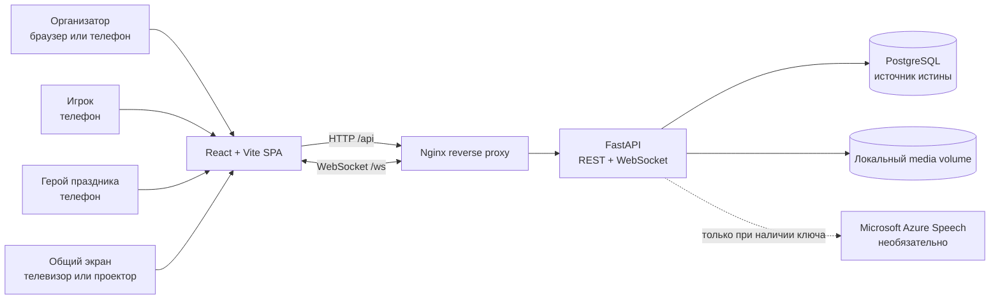
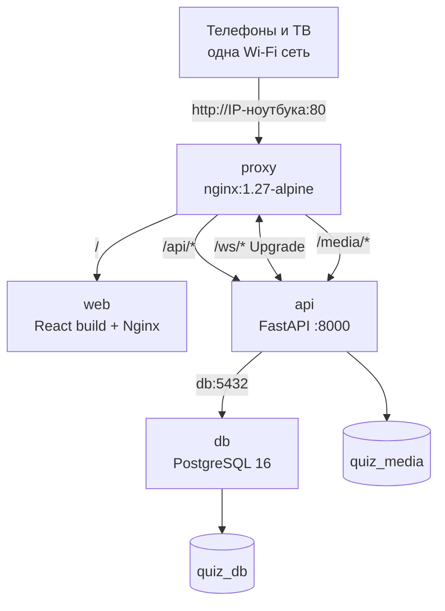
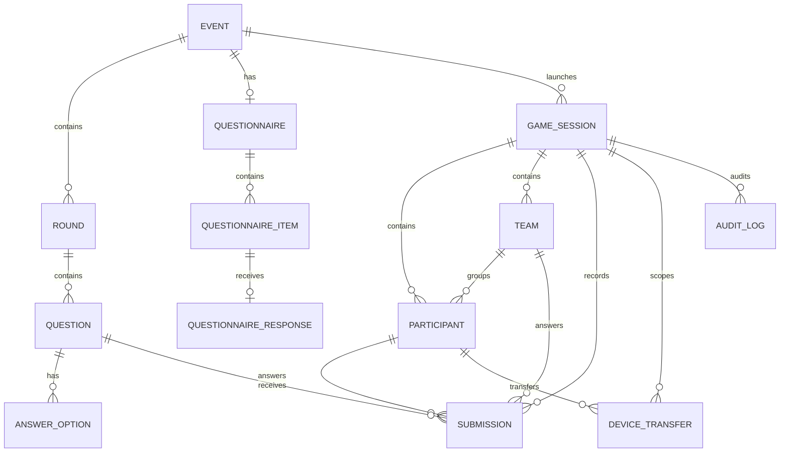
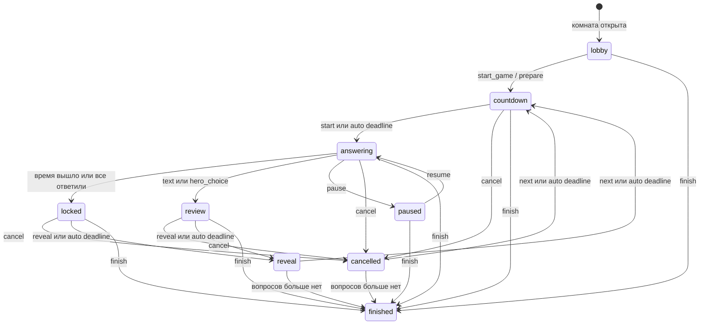
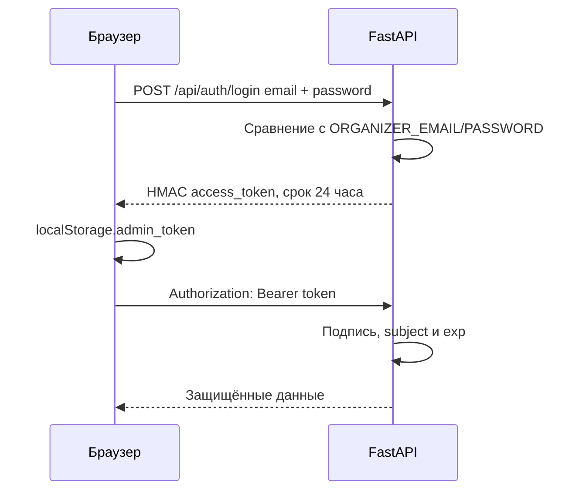
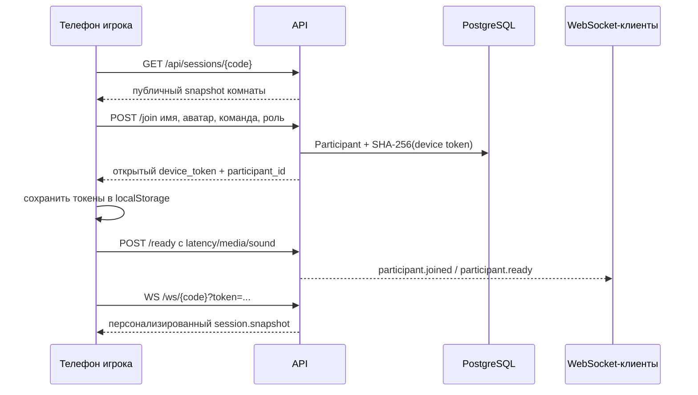
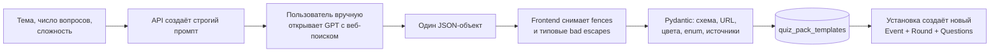
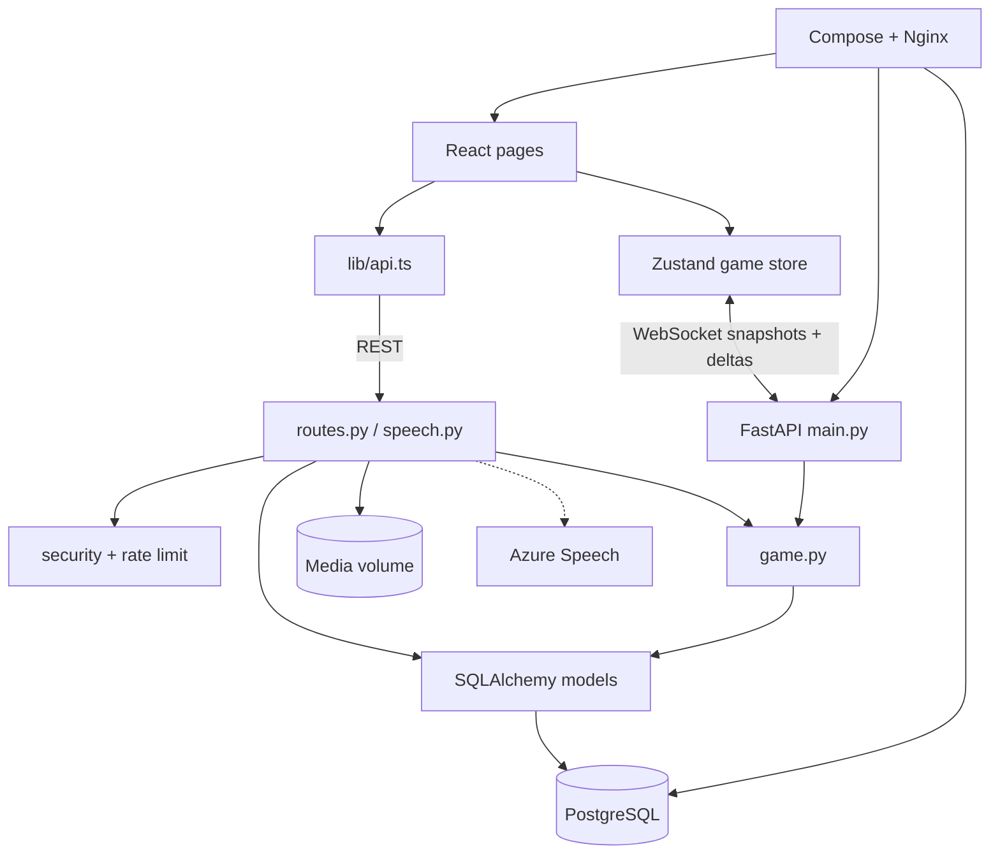
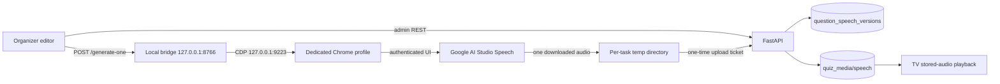

# Полная архитектура проекта «Свои знают»

> Единый технический документ: что находится в проекте, какие компоненты за что отвечают, откуда и куда идут данные, как проходит игра, где хранятся данные и как приложение запускается.
>
> Актуальность: 3 августа 2026 года, состояние репозитория на коммите `d679a60` (`chore: add Vercel frontend config`). Документ описывает фактически реализованный код, а не только предполагаемую целевую архитектуру.

## Оглавление

1. Кратко о системе
2. Системный контекст
3. Структура монорепозитория
4. Логическая архитектура
5. Runtime и сетевой маршрут
6. Модель данных
7. Игровой автомат состояний
8. Типы вопросов и подсчёт результата
9. Основные потоки данных
10. REST API
11. WebSocket-протокол
12. Безопасность и границы доверия
13. Конфигурация
14. Запуск
15. PWA и offline-поведение
16. Медиа, сохранность и резервные копии
17. Тестирование и проверка
18. Текущие ограничения и технический долг
19. Практическая трассировка изменений
20. Итоговая схема ответственности
21. MVP сохранённой озвучки через Google AI Studio

## 1. Кратко о системе

«Свои знают» — полноэкранная интерактивная quiz-платформа с четырьмя основными ролями интерфейса:

1. **Организатор** создаёт и настраивает квизы, открывает комнату и управляет эфиром.
2. **Игрок** входит по коду без регистрации и отвечает с телефона.
3. **Герой праздника** участвует в персональном формате и может определять правильный ответ в вопросах типа `hero_choice`.
4. **Телевизионный экран** показывает лобби, текущий вопрос, статистику ответов и финал.

Поддерживаются два формата:

- `celebration` — персональный праздник о конкретном человеке: есть герой, анкета героя и вопросы типа «Выбор героя»;
- `battle` — тематический квиз-баттл: тема может быть любой, но роль героя и связанные функции запрещены.

Поддерживаются два игровых режима:

- `individual` — каждый игрок отвечает и получает результат отдельно;
- `team` — участники входят в команду, но ответ отправляет только первый вошедший участник, назначенный капитаном.

Главный принцип архитектуры: **FastAPI и PostgreSQL являются источником истины**, а браузеры получают серверные снимки состояния. Игровая логика, дедлайны, правильность ответов и рейтинг не доверяются клиенту.

## 2. Системный контекст



### Кто с кем общается

| Источник | Получатель | Канал | Назначение |
|---|---|---|---|
| Браузер организатора | FastAPI | REST `/api/*` | Вход, CRUD квизов, управление игрой, результаты |
| Браузер игрока | FastAPI | REST `/api/sessions/*` | Вход в комнату, готовность, отправка ответа, перенос устройства |
| Любой игровой экран | FastAPI | WebSocket `/ws/{code}` | Получение актуального состояния комнаты в реальном времени |
| Телевизионный экран | FastAPI | REST `/api/speech/*` | Получение серверного TTS текущего вопроса |
| FastAPI | PostgreSQL | SQLAlchemy | События, вопросы, комнаты, игроки, ответы, история |
| FastAPI | media volume | Файловая система | Изображения и аудиофайлы вопросов |
| FastAPI | Azure Speech | HTTPS | Синтез речи, если настроены ключ и регион |

## 3. Структура монорепозитория

```text
.
├── apps/
│   ├── api/                         # FastAPI-приложение
│   │   ├── app/
│   │   │   ├── main.py              # Запуск API, lifespan, WebSocket, фоновые дедлайны
│   │   │   ├── routes.py            # Основной REST API и Pydantic-контракты
│   │   │   ├── models.py            # SQLAlchemy-модели БД
│   │   │   ├── game.py              # Правила, состояния, рейтинг, снимок комнаты
│   │   │   ├── realtime.py          # In-memory WebSocket hub
│   │   │   ├── security.py          # Токен организатора и токены устройств
│   │   │   ├── rate_limit.py         # In-memory rate limit по IP
│   │   │   ├── speech.py             # Интеграция Azure Speech и LRU-кеш аудио
│   │   │   ├── speech_mvp.py         # Голоса, стили, source hash и сериализация сохранённых версий
│   │   │   ├── quiz_packs.py         # Встроенные тематические наборы
│   │   │   ├── seed.py               # Демонстрационные данные первого запуска
│   │   │   ├── config.py             # Переменные окружения
│   │   │   └── db.py                 # Engine, сессии SQLAlchemy, SQLite-настройки
│   │   ├── migrations/               # Alembic 0001–0008
│   │   ├── tests/                    # API, игровые правила, миграции, TTS, нагрузка
│   │   ├── Dockerfile
│   │   └── requirements.txt
│   └── web/                           # React SPA
│       ├── src/
│       │   ├── App.tsx                # Выбор страницы по URL
│       │   ├── pages/                  # Главная, админка, вход, игрок, ТВ, герой, каталог
│       │   ├── lib/api.ts              # Все REST-вызовы и построение WebSocket URL
│       │   ├── store/game.ts           # Zustand store и WebSocket-клиент
│       │   ├── lib/questionSpeech.ts   # Сохранённый файл -> Azure TTS -> Web Speech fallback
│       │   ├── components/QuestionSpeechEditor.tsx # Голос, стили и версии озвучки
│       │   ├── lib/quizPackImport.ts   # Очистка JSON перед импортом
│       │   └── types.ts                # Типы клиентских контрактов
│       ├── public/                      # PWA manifest, service worker, icon
│       ├── Dockerfile
│       ├── nginx.conf                   # SPA fallback внутри web-контейнера
│       └── vite.config.ts               # Dev-сервер и proxy на API
├── infra/
│   ├── compose.lan.yml                  # Полностью локальный профиль
│   ├── compose.cloud.yml                # Облачный профиль с Redis
│   ├── nginx/default.conf               # Внешняя маршрутизация API/WS/media/web
│   ├── env/*.example.env                # Шаблоны переменных окружения
│   └── scripts/backup.ps1, restore.ps1  # Backup/restore PostgreSQL
├── packages/contracts/
│   └── game-events.schema.json          # Базовая JSON Schema WebSocket-конверта
├── docs/                                # Краткие старые документы
├── tools/ai-studio-speech-bridge/       # Windows helper: Chrome/CDP, download и upload
├── start-quiz-mvp.ps1                   # Общий запуск LAN Compose и local bridge
├── GOOGLE_AI_STUDIO_SPEECH_PARSER_MVP_PLAN.md
├── README.md
└── PROJECT_ARCHITECTURE.md              # Этот единый документ
```

## 4. Логическая архитектура

### 4.1 Frontend

Frontend — одно React-приложение. Отдельных сборок для организатора, игрока и телевизора нет: `App.tsx` выбирает страницу по `location.pathname`.

| URL | Компонент | Для кого | Что делает |
|---|---|---|---|
| `/` | `HomePage` | Все | Главная, ввод кода комнаты, переход в каталог и админку |
| `/quizzes` | `QuizCatalogPage` | Все | Публичный каталог встроенных и пользовательских шаблонов |
| `/quiz/{slug}` | `QuizCatalogPage` | Все | Страница одного набора, описание, примеры, источники |
| `/admin` | `OrganizerPage` | Организатор | Вход, библиотека, редактор, эфир, настройки, история |
| `/join` | `JoinPage` | Игрок | Ручной ввод кода комнаты |
| `/join/{code}` | `JoinPage` | Игрок или герой | Имя, аватар, команда, роль, выдача токена устройства |
| `/play/{code}` | `GuestPage` | Игрок или герой | Ожидание, ответы, приватный результат, финал |
| `/screen/{code}` | `ScreenPage` | Телевизор | QR-код, вопрос, live insights, раскрытие, пьедестал |
| `/hero/{token}` | `HeroPage` | Герой до игры | Заполнение персональной анкеты по длинному токену |

`lib/router.tsx` — собственный минимальный History API router. При неизвестном URL приложение возвращает пользователя на `/`.

### 4.2 Backend

FastAPI разделён по обязанностям:

| Модуль | Ответственность |
|---|---|
| `main.py` | Создаёт приложение, запускает миграционно-независимую проверку таблиц, seed, таймер состояний и WebSocket endpoint |
| `routes.py` | Валидирует входные данные и реализует основной REST API |
| `game.py` | Проверяет ответы, пересчитывает результаты, двигает автомат состояний и формирует клиентский снимок |
| `models.py` | Описывает постоянную модель данных |
| `realtime.py` | Хранит активные WebSocket-соединения в памяти одного Python-процесса |
| `security.py` | Проверяет HMAC-токен организатора; выдаёт и хеширует токены устройств |
| `rate_limit.py` | Ограничивает чувствительные POST-запросы по IP в памяти процесса |
| `speech.py` | Отдаёт MP3 текущего вопроса из Azure Speech и кеширует до 256 аудио в памяти |
| `quiz_packs.py` | Содержит три встроенных набора и функции их публичной сериализации |
| `seed.py` | При пустой БД создаёт демонстрационный праздник с тремя вопросами |

### 4.3 Источник истины

Постоянное состояние находится в БД. Клиент хранит только:

- `admin_token` — токен организатора в `localStorage`;
- `device_{ROOM}` — открытый токен устройства игрока;
- `participant_{ROOM}` — ID игрока;
- локальные черновики вопросов;
- черновик JSON и последний GPT-промпт для конструктора наборов;
- настройку озвучивания телевизионного экрана.

Если браузерное локальное состояние потеряно, данные самой игры остаются в PostgreSQL, но игроку потребуется войти заново или запросить перенос существующего участника на новое устройство.

## 5. Runtime и сетевой маршрут

### 5.1 LAN-профиль



Сервисы `infra/compose.lan.yml`:

| Сервис | Образ/сборка | Публичный порт | Зависимости |
|---|---|---:|---|
| `db` | `postgres:16-alpine` | Нет | volume `quiz_db` |
| `api` | `apps/api/Dockerfile` | Нет | ждёт healthy `db`, volume `quiz_media` |
| `web` | `apps/web/Dockerfile` | Нет | ждёт healthy `api` |
| `proxy` | `nginx:1.27-alpine` | `80` | направляет трафик в `web` и `api` |

После сборки интернет для основной игры и повторного воспроизведения сохранённой озвучки не нужен. Интернет требуется при создании нового файла через Google AI Studio и при Azure fallback. Если оба облачных источника недоступны, телевизор использует Web Speech API браузера, если этот API и русский голос доступны на устройстве.

### 5.2 Cloud-профиль

Cloud-профиль добавляет:

- `restart: unless-stopped`;
- обязательные внешние секреты;
- Redis 7 с AOF volume;
- ожидаемый публичный `PUBLIC_BASE_URL`;
- требование завершать TLS перед текущим Nginx.

Важно: **Redis сейчас только запускается, но `realtime.py` его не использует**. WebSocket hub и rate limit остаются in-memory. Поэтому текущий API должен работать одним процессом/репликой. Несколько API-инстансов будут иметь разные наборы WebSocket-клиентов и разные лимитеры.

### 5.3 Маршрутизация Nginx

| Входной путь | Получатель | Особенности |
|---|---|---|
| `/api/` | `api:8000/api/` | Передаются `Host`, `X-Forwarded-Proto`, `X-Forwarded-For` |
| `/ws/` | `api:8000/ws/` | HTTP/1.1, `Upgrade`, `Connection: upgrade`, timeout 3600 s |
| `/media/` | `api:8000/media/` | FastAPI StaticFiles читает локальный media volume |
| `/` | `web:80` | React SPA; внутренний Nginx делает fallback на `index.html` |

Максимальный размер тела запроса на внешнем proxy — 25 МБ. API отдельно применяет `MAX_UPLOAD_MB`, по умолчанию тоже 25 МБ.

## 6. Модель данных



### 6.1 `events`

Это сохранённый квиз, а не конкретный запуск игры.

Основные поля:

- `id` — UUID;
- `title` — название;
- `event_format` — `celebration` или `battle`;
- `topic` — тема баттла;
- `hero_name` — имя героя праздника;
- `status` — обычно `draft`, `ready` или `archived`;
- `is_selected` — какой квиз формирует публичный брендинг и открыт в админке;
- `game_mode` — `individual` или `team`;
- `host_mode` — `auto` или `manual`;
- `auto_advance_seconds` — пауза автоматического ведущего между экранами, 2–30 секунд;
- `tv_display_mode` — `classic` или `insights`;
- `tv_chart_style` — `both`, `pie` или `bar`;
- `theme` — JSON с цветами, текстами бренда и эффектом;
- `allow_late_join` — разрешён ли вход после начала;
- `hero_photo_url` — ссылка на фото;
- `created_at`, `updated_at`.

Один `Event` может запускаться многократно: каждый запуск создаёт новую `GameSession`, поэтому история не стирается.

### 6.2 `rounds`, `questions`, `answer_options`

`Round` группирует вопросы и задаёт порядок. Игра берёт максимум первые 50 активных вопросов по `round.sort_order`, затем по `question.sort_order`.

`Question` хранит:

- тип;
- текст и лимит времени;
- `correct_answer` как JSON;
- синонимы `accepted_answers`;
- числовой допуск;
- необходимость перемешать варианты;
- пояснение;
- media URL/type;
- число допустимых повторов аудио;
- статус и порядок.

`AnswerOption` хранит варианты выбора. Для вопросов выбора `correct_answer` содержит ID варианта или список ID.

### 6.3 `questionnaires`

Для персонального праздника создаётся одна анкета:

- длинный `public_token` используется как секрет публичной ссылки;
- вопросы находятся в `questionnaire_items`;
- ответ каждого пункта находится в `questionnaire_responses`;
- организатор может конвертировать заполненный пункт в обычный текстовый вопрос.

### 6.4 `game_sessions`

Это конкретная игровая комната:

- `join_code` — уникальный шестизначный код без неоднозначных `I` и `O`;
- `status` — состояние автомата игры;
- `current_question_id`, `current_question_index` — текущая позиция;
- `state_version` — монотонная версия состояния;
- `deadline_at` — серверный дедлайн текущего экрана;
- `paused_remaining_ms` — остаток времени после паузы;
- `started_at`, `finished_at`;
- `deployment_mode` — режим запуска, записанный в момент создания комнаты.

### 6.5 `participants` и `teams`

Участник хранит имя, первую букву отчества, аватар, роль, команду, readiness, latency, время входа и статус соединения.

Открытый токен устройства не хранится. В БД записывается только `SHA-256` в `device_token_hash`. Для поздно вошедшего `eligible_from_index` становится равным следующему вопросу.

В командном режиме при создании комнаты автоматически создаются команды «Мандарины» и «Искры». Первый участник команды становится капитаном. В текущем UI отдельного редактора состава/названий команд нет.

### 6.6 `submissions`

Каждый ответ содержит:

- глобально уникальный `request_id` для идемпотентности;
- комнату и вопрос;
- либо `participant_id`, либо `team_id`;
- ответ как JSON;
- серверное время отправки и `elapsed_ms`;
- результат `is_correct`;
- `validation_status`: автоматический или ручной.

Один игрок или одна команда могут дать только один фактический ответ на вопрос: повтор возвращает уже принятый результат.

### 6.7 `quiz_pack_templates`, `device_transfers`, `audit_logs`

- `quiz_pack_templates` хранит импортированный пользовательский набор целиком как JSON и уникальный slug.
- `device_transfers` реализует подтверждаемый организатором перенос существующего участника на новый браузер.
- `audit_logs` записывает важные изменения: редактирование, действия ведущего, импорт набора, перенос устройства и изменение правильности.

## 7. Игровой автомат состояний



### 7.1 Ручной ведущий

При `host_mode=manual` промежуточные экраны не получают автоматический дедлайн. Организатор последовательно вызывает действия:

1. `start_game`/`prepare` — выбрать вопрос и показать countdown;
2. `start` — открыть ответы;
3. `lock` — закрыть ответы;
4. `reveal` — показать правильный ответ;
5. `next` — перейти к следующему вопросу.

Таймер самого ответа всегда серверный: после `start` создаётся `deadline_at = now + time_limit_seconds`.

### 7.2 Автоматический ведущий

При `host_mode=auto` фоновая задача в `main.py` каждые 0,5 секунды ищет истёкшие `deadline_at` и выполняет следующий переход.

Автоматически планируются `countdown`, `locked`, `review`, `reveal` и `cancelled`. Для `hero_choice` после закрытия ответов автопереход приостанавливается: сервер ждёт решения героя.

### 7.3 Версионирование

Каждое значимое изменение увеличивает `GameSession.state_version`. Клиент применяет новый snapshot, только если его версия не меньше уже полученной. Это защищает экран от запоздавших WebSocket-сообщений.

Часть быстрых событий приходит как дельта (`participant.joined`, `participant.ready`, `question.progress`), а при смене состояния или включённых insights сервер отправляет полный `session.snapshot`.

## 8. Типы вопросов и подсчёт результата

| Тип | Формат ответа | Проверка |
|---|---|---|
| `single` | ID одного варианта | Строгое совпадение с `correct_answer` |
| `multiple` | Массив ID | Полное совпадение множеств, без лишних вариантов |
| `text` | Строка | Регистр, пробелы, пунктуация и `ё/е` нормализуются; учитываются синонимы |
| `number` | Число | Абсолютная разница не больше `numeric_tolerance` |
| `closest` | Число | Побеждают все ответы с минимальной ошибкой среди присланных |
| `hero_choice` | ID варианта | Правильный вариант после ответов задаёт герой |

Рейтинг сортируется так:

1. больше правильных ответов;
2. меньше суммарное `elapsed_ms` только по правильным ответам;
3. имя по алфавиту — только для устойчивого порядка отображения.

При равных числе правильных и времени участники получают одинаковое место. Герой присутствует в индивидуальном рейтинге, но его собственный `hero_choice` не создаёт обычный `Submission` и не даёт ему балл.

До финала общий `leaderboard` в snapshot пуст. Игрок может получить только свой `private_result`, а на reveal — правильность собственного ответа.

## 9. Основные потоки данных

### 9.1 Вход организатора



Учётная запись одна и задаётся через переменные окружения. Пользователи/роли организаторов в БД не заведены.

### 9.2 Создание квиза и комнаты

1. Организатор создаёт `Event`.
2. Сервер создаёт первый `Round`; для celebration — ещё и анкету из трёх пунктов.
3. Организатор создаёт вопросы или устанавливает шаблон.
4. `POST /events/{id}/sessions` проверяет наличие вопросов.
5. Если уже есть незавершённая комната этого квиза, возвращается она.
6. Иначе создаётся `GameSession` со статусом `lobby` и кодом входа.
7. В командном режиме создаются две стартовые команды.

### 9.3 Вход игрока



Если одинаковое имя уже занято, API просит первую букву отчества. Если это тот же человек на новом устройстве, он создаёт transfer request; организатор подтверждает его, после чего старый device token заменяется.

### 9.4 Отправка ответа

1. Игрок генерирует UUID `request_id`.
2. `POST /api/sessions/{code}/answer` берёт строковую блокировку комнаты через `SELECT ... FOR UPDATE`.
3. Сервер проверяет токен устройства, статус `answering`, право поздно вошедшего и дедлайн.
4. В командном режиме дополнительно проверяется капитан.
5. Проверяется идемпотентность по `request_id` и наличие ответа сущности на текущий вопрос.
6. `elapsed_ms` вычисляется по серверному дедлайну, а не по часам телефона.
7. Ответ записывается в `submissions`.
8. Если ответили все ожидаемые игроки/команды, вопрос закрывается раньше таймера.
9. WebSocket-клиенты получают прогресс либо полный snapshot.

### 9.5 Snapshot комнаты

Полный `session.snapshot` содержит:

- версию и серверное время;
- статус, индекс вопроса, дедлайн и прогресс ответов;
- краткие данные события и тему;
- публичную версию текущего вопроса;
- участников и команды;
- live answers и breakdown для телевизора;
- персональный результат, только если WebSocket/REST вызван с device token;
- общий рейтинг только после завершения.

Правильный ответ и explanation не включаются до `reveal`, `finished` или `archived`.

### 9.6 Анкета героя

1. Сервер формирует `/hero/{public_token}`.
2. Герой открывает ссылку без учётной записи.
3. Ответы отправляются в `/api/questionnaires/{token}/submit`.
4. Анкета получает статус `completed`.
5. Организатор видит ответы и может превратить любой пункт в текстовый вопрос.

Токен в URL фактически является доступом к анкете; его нельзя публиковать как обычную открытую ссылку.

### 9.7 GPT-набор



API сам не вызывает модель. Он только:

- генерирует промпт;
- принимает вставленный JSON;
- нормализует типичные Markdown-ссылки и экранированные скобки;
- проверяет JSON через `QuizPackImportBody`;
- сохраняет пользовательский шаблон;
- устанавливает шаблон как независимый `Event`.

Встроенные шаблоны живут в Python-коде, пользовательские — в БД. Встроенные удалить или редактировать через API нельзя.

### 9.8 Озвучивание вопроса

Озвучка имеет два независимых потока: предварительное создание файла организатором и воспроизведение во время игры.

При предварительном создании:

1. Редактор сохраняет голос и структурированные style settings для квиза или вопроса.
2. Backend выдаёт подписанный одноразовый ticket, связанный с `question_id`, текстом, голосом, настройками и версией prompt builder.
3. Frontend отправляет задачу локальному bridge на `127.0.0.1:8766`; organizer token ему не передаётся.
4. Bridge управляет отдельным Chrome profile через CDP, получает файл из Google AI Studio и проверяет его magic bytes.
5. Bridge загружает файл по ticket в `/api/questions/{id}/speech/upload`.
6. Первый файл становится `active`; следующая переозвучка остаётся `candidate`, пока организатор её не применит.

При воспроизведении:

1. TV сначала открывает `speech_audio_url` активной сохранённой версии.
2. Если сохранённого файла нет или он не воспроизводится, TV запрашивает `/api/speech/sessions/{code}/questions/{question_id}`.
3. Сервер разрешает Azure TTS только для текущего вопроса в статусе `answering`; в Azure передаётся только текст вопроса, не варианты ответа.
4. Azure MP3 кешируется в памяти API по региону, голосу и тексту; максимум 256 элементов.
5. При отсутствии Azure или сетевой ошибке frontend переходит на Web Speech API браузера.
6. Каждый новый вопрос автоматически читается один раз; повтор снова использует сохранённый файл и не запускает Google AI Studio.

## 10. REST API

Префикс всех HTTP-маршрутов — `/api`. Пометка **admin** означает обязательный `Authorization: Bearer ...`.

### 10.1 Общие и публичные

| Метод | Путь | Доступ | Назначение |
|---|---|---|---|
| GET | `/health` | Публичный | Проверка API и доступности БД |
| GET | `/branding` | Публичный | Тема выбранного неархивного квиза |
| POST | `/auth/login` | Публичный | Получить токен организатора |
| POST | `/media` | **admin** | Загрузить JPG/PNG/WebP/MP3/M4A/OGG |

### 10.2 Каталог и шаблоны

| Метод | Путь | Доступ | Назначение |
|---|---|---|---|
| GET | `/quiz-packs` | Публичный | Встроенные и пользовательские шаблоны |
| GET | `/quiz-packs/{slug}` | Публичный | Публичная карточка набора |
| POST | `/quiz-packs/gpt-prompt` | **admin** | Сгенерировать промпт для внешнего GPT |
| POST | `/quiz-packs/import` | **admin** | Импортировать новый JSON-шаблон |
| GET | `/quiz-packs/{slug}/definition` | **admin** | Получить полный JSON пользовательского шаблона |
| PUT | `/quiz-packs/{slug}/definition` | **admin** | Обновить пользовательский шаблон |
| DELETE | `/quiz-packs/{slug}` | **admin** | Удалить пользовательский шаблон |
| POST | `/quiz-packs/{slug}/install` | **admin** | Создать новый battle event из шаблона |

### 10.3 События, анкета и вопросы

| Метод | Путь | Доступ | Назначение |
|---|---|---|---|
| GET | `/events` | **admin** | Вся библиотека квизов |
| POST | `/events` | **admin** | Создать квиз |
| GET | `/events/{id}` | **admin** | Получить квиз полностью |
| PUT | `/events/{id}` | **admin** | Обновить все настройки квиза |
| POST | `/events/{id}/select` | **admin** | Сделать квиз выбранным |
| POST | `/events/{id}/archive` | **admin** | Архивировать после завершения комнат |
| POST | `/events/{id}/restore` | **admin** | Восстановить и выбрать квиз |
| PUT | `/events/{id}/host-control` | **admin** | Auto/manual и задержка перехода |
| PUT | `/events/{id}/tv-display` | **admin** | Classic/insights и стиль графика |
| POST | `/events/{id}/questionnaire/items` | **admin** | Добавить пункт анкеты |
| GET | `/questionnaires/{token}` | По токену URL | Получить анкету |
| POST | `/questionnaires/{token}/submit` | По токену URL | Сохранить ответы героя |
| POST | `/questionnaire-items/{id}/to-question` | **admin** | Создать вопрос из ответа |
| POST | `/events/{id}/questions` | **admin** | Создать вопрос |
| PUT | `/questions/{id}` | **admin** | Обновить вопрос |
| DELETE | `/questions/{id}` | **admin** | Удалить вопрос |
| POST | `/events/{id}/question-presets` | **admin** | Добавить до пяти демонстрационных вопросов |

### 10.4 Комната и игровой процесс

| Метод | Путь | Доступ | Назначение |
|---|---|---|---|
| POST | `/events/{id}/sessions` | **admin** | Открыть или вернуть активную комнату |
| GET | `/sessions/{code}` | Публичный/устройство | Получить snapshot; с token — персонализированный |
| POST | `/sessions/{code}/join` | Публичный | Создать участника и получить device token |
| POST | `/sessions/{code}/ready` | Устройство | Записать готовность и latency |
| POST | `/sessions/{code}/answer` | Устройство | Отправить идемпотентный ответ |
| POST | `/sessions/{code}/hero-choice` | Герой | Задать правильный вариант hero_choice |
| POST | `/sessions/{code}/actions` | **admin** | Команда игровому автомату |
| GET | `/sessions/{code}/results` | **admin** | Полный рейтинг и все ответы |
| PUT | `/sessions/{code}/questions/{id}/correct-answer` | **admin** | Исправить правильный ответ и пересчитать |
| PUT | `/sessions/{code}/submissions/{id}/review` | **admin** | Ручная проверка ответа |
| POST | `/sessions/{code}/transfer-requests` | Публичный | Запросить перенос игрока |
| GET | `/sessions/{code}/transfer-requests` | **admin** | Список ожидающих переносов |
| POST | `/sessions/{code}/transfer-requests/{id}/approve` | **admin** | Разрешить перенос |
| POST | `/sessions/{code}/transfer-requests/{id}/claim` | По claim token | Получить новый device token |
| GET | `/speech/sessions/{code}/questions/{id}` | Публичный, контекстный | MP3 только текущего вопроса |

### 10.7 Сохранённые версии озвучки

| Метод | Путь | Доступ | Назначение |
|---|---|---|---|
| GET | `/speech/mvp/config` | **admin** | Curated-голоса, presets, defaults и bridge URL |
| PUT | `/events/{id}/speech-settings` | **admin** | Настройки озвучки квиза |
| GET | `/questions/{id}/speech` | **admin** | Active/candidate/previous и история вопроса |
| PUT | `/questions/{id}/speech-settings` | **admin** | Override вопроса или возврат к defaults квиза |
| POST | `/questions/{id}/speech/automation-ticket` | **admin** | Одноразовый ticket на один source hash |
| POST | `/questions/{id}/speech/upload` | По speech ticket | Проверить и сохранить WAV/MP3/M4A/OGG |
| POST | `/questions/{id}/speech/versions/{version_id}/activate` | **admin** | Сделать candidate активным |
| POST | `/questions/{id}/speech/versions/{version_id}/restore` | **admin** | Вернуть previous без повторной генерации |
| DELETE | `/questions/{id}/speech/versions/{version_id}` | **admin** | Удалить выбранную версию и её speech-файл |

## 11. WebSocket-протокол

Endpoint: `/ws/{code}`. Для персонального состояния используется query-параметр `token`.

Клиент отправляет:

- `{"type":"ping","sent_at":<timestamp>}` — сервер отвечает `pong` для измерения latency;
- `{"type":"snapshot.request"}` — сервер повторно формирует полный snapshot.

Сервер отправляет:

- `session.snapshot` — полный снимок;
- `participant.joined` — добавился участник;
- `participant.ready` — участник прошёл проверку;
- `question.progress` — изменилось число ответивших;
- `pong` — ответ на ping.

При закрытии сокета Zustand store помечает соединение offline и через 1,5 секунды пытается подключиться снова. После персонализированного snapshot клиент дополнительно делает REST refresh, чтобы восстановить приватный результат.

`packages/contracts/game-events.schema.json` сейчас описывает только общий snapshot и ping, но не все фактически отправляемые дельты. TypeScript-типы и backend JSON не генерируются из этой schema автоматически.

## 12. Безопасность и границы доверия

### Реализовано

- Организаторские endpoint защищены подписанным HMAC-токеном со сроком 24 часа.
- Открытые device tokens случайны и в БД хранятся только как SHA-256.
- Токен переноса также хранится в виде хеша и действует 10 минут.
- Ответ проверяется сервером; клиент не определяет правильность или время.
- `SELECT FOR UPDATE` сериализует одновременную отправку ответов в комнате на PostgreSQL.
- Есть проверка MIME-типа и размера media upload.
- CORS задаётся разрешённым списком.
- Для login/join/answer/transfer есть IP rate limit.
- Azure Speech key остаётся на backend и не попадает в `VITE_*`.
- В импортируемом наборе проверяются enum, длины, HTTPS URL, HEX-цвета, уникальность вопросов и принадлежность ссылок заявленным источникам.

### Что важно учитывать

- Пароль организатора один на весь инстанс и сравнивается напрямую с env-значением; отдельной таблицы пользователей, MFA и ротации сессий нет.
- `admin_token` и device token лежат в `localStorage`; защита от XSS критична.
- Текущий proxy не добавляет собственные security headers и TLS не завершает.
- Rate limit и WebSocket hub существуют только в памяти одного API-процесса.
- Публичный join code даёт доступ к публичному состоянию комнаты; приватный результат требует device token.
- Ссылка анкеты и claim token являются bearer-секретами.
- Media-файлы после загрузки доступны по предсказуемому публичному пути, если известен полный сгенерированный filename.
- Текущая проверка upload доверяет заявленному `Content-Type`; сигнатура файла/антивирус отдельно не проверяются.

Rate limit за 60 секунд на один IP:

| Операция | Лимит |
|---|---:|
| Login | 30 |
| Join | 150 |
| Answer | 600 |
| Transfer request | 60 |

## 13. Конфигурация

| Переменная | По умолчанию в коде | Назначение |
|---|---|---|
| `DATABASE_URL` | `sqlite:///./celebration_quiz.db` | Строка подключения SQLAlchemy |
| `SECRET_KEY` | dev-значение | HMAC-подпись admin token |
| `ORGANIZER_EMAIL` | `organizer@example.local` | Единственный логин организатора |
| `ORGANIZER_PASSWORD` | `celebrate` | Пароль организатора |
| `DEPLOYMENT_MODE` | `lan` | Маркер режима в health и session |
| `PUBLIC_BASE_URL` | `http://localhost:5173` | Абсолютные ссылки анкеты/шаринга |
| `MEDIA_DIR` | `./media` | Каталог загруженных файлов |
| `CORS_ORIGINS` | localhost:5173 и localhost | Разрешённые browser origins |
| `MAX_UPLOAD_MB` | `25` | Максимальный media upload |
| `AZURE_SPEECH_KEY` | пусто | Ключ TTS |
| `AZURE_SPEECH_REGION` | пусто | Регион TTS |
| `AZURE_SPEECH_VOICE` | `ru-RU-SvetlanaNeural` | Голос |
| `AZURE_SPEECH_TIMEOUT_SECONDS` | `8.0` | Таймаут запроса в Azure |
| `VITE_API_BASE` | `/api` | Необязательный адрес API для frontend |
| `VITE_WS_BASE` | origin страницы | Необязательный адрес WebSocket |

Для LAN следует копировать `infra/env/lan.example.env`, заменить `SECRET_KEY`, пароль организатора и `PUBLIC_BASE_URL` на фактический IP ноутбука. Значения Compose по умолчанию подходят только для изолированной локальной разработки, не для публичного доступа.

## 14. Запуск

### 14.1 Локальная разработка

Backend:

```powershell
cd apps/api
python -m venv .venv
.\.venv\Scripts\pip install -r requirements.txt
.\.venv\Scripts\uvicorn app.main:app --reload --port 8000
```

Frontend из корня, во втором окне:

```powershell
npm install
npm run dev
```

Vite слушает `0.0.0.0:5173` и проксирует `/api`, `/media`, `/ws` на `localhost:8000`. В режиме разработки backend по умолчанию использует SQLite с WAL, busy timeout и foreign keys.

### 14.2 LAN Docker

```powershell
docker compose --env-file infra/env/lan.env -f infra/compose.lan.yml up --build -d
docker compose -f infra/compose.lan.yml ps
```

Проверка:

```powershell
Invoke-RestMethod http://localhost/api/health
```

Затем с телефона открыть `http://<IP-ноутбука>`. Все устройства должны быть в одной сети, а client/AP isolation на роутере должен быть отключён.

### 14.3 Cloud Docker

```powershell
Copy-Item infra/env/cloud.example.env .env
# заполнить .env
docker compose --env-file .env -f infra/compose.cloud.yml up --build -d
```

Перед текущим proxy нужен HTTPS termination. Пока Redis fan-out не реализован, не масштабировать `api` горизонтально.

### 14.4 Порядок старта API

1. Docker выполняет `alembic upgrade head`.
2. Запускается Uvicorn.
3. Lifespan дополнительно вызывает `Base.metadata.create_all`.
4. Если таблица `events` пуста, создаётся demo event.
5. Запускается фоновый watcher дедлайнов.

Миграции до текущей ревизии: `0001` initial, `0002` форматы, `0003` библиотека/выбор, `0004` управление ведущим, `0005` TV insights, `0006` пользовательские наборы.

## 15. PWA и offline-поведение

Production frontend регистрирует `sw.js`:

- app shell (`/`, manifest, icon) кешируется при установке;
- остальные GET-ресурсы кешируются после успешной загрузки;
- `/api/` и `/ws/` не кешируются;
- при сетевой ошибке возвращается кешированный ресурс или `/`.

Это означает, что оболочка приложения может открыться без интернета, но игровое состояние всё равно требует доступного локального/облачного API. LAN offline означает «без внешнего интернета», а не «без соединения с ноутбуком-сервером».

## 16. Медиа, сохранность и резервные копии

### Медиа

Поддерживаются:

- изображения: JPEG, PNG, WebP;
- аудио: MP3, M4A, OGG.

Файл сохраняется как `{event_id}-{random_uuid}.{ext}` в `MEDIA_DIR`. В Docker это volume `quiz_media`. Удаление вопроса или события не удаляет соответствующий файл автоматически.

### PostgreSQL backup

`infra/scripts/backup.ps1` делает custom-format `pg_dump`, а `restore.ps1` выполняет `pg_restore --clean --if-exists`.

Media volume не попадает в дамп PostgreSQL и должен копироваться отдельно. Restore является разрушающей операцией для целевой БД: существующие объекты заменяются содержимым дампа.

## 17. Тестирование и проверка

Основные команды:

```powershell
npm test
npm run build
```

Backend следует запускать в установленном Python-окружении или проектном Docker-контейнере:

```powershell
cd apps/api
python -m pytest -q
```

Покрытые сценарии:

- полный вертикальный игровой цикл;
- auto/manual ведущий;
- запрет hero-функций в battle;
- каталог, установка и CRUD пользовательского набора;
- публичный брендинг выбранного квиза;
- нормализация текста, multiple и numeric tolerance;
- round-trip миграций;
- Azure Speech и запрет озвучивать неактуальный вопрос;
- frontend timer по серверному deadline;
- финал организатора и TV insights;
- импорт JSON и понятные ошибки валидации;
- локальная и серверная озвучка;
- lifecycle сохранённых active/candidate/previous версий, одноразовый upload-ticket и magic bytes;
- stored-audio-first, offline repeat и fallback сохранённый файл → Azure → Web Speech;
- local bridge allowlist, prompt builder и проверка upload URL;
- генерация UUID в LAN HTTP.

`apps/api/tests/load_100.py` существует как отдельный сценарий нагрузки на 100 клиентов, но не входит в обычный набор unit/integration tests автоматически.

## 18. Текущие ограничения и технический долг

Это не обязательно ошибки, но это реальные границы текущей реализации:

1. **Один API-процесс.** Redis объявлен в cloud Compose, но pub/sub fan-out не подключён.
2. **In-memory rate limit.** После рестарта счётчики сбрасываются; между репликами не синхронизируются.
3. **Локальное media storage.** S3-адаптера или абстракции хранилища в коде сейчас нет.
4. **Один организатор.** Нет пользователей, ролей, MFA, отзыва отдельных токенов и журнала входов.
5. **Неполная JSON Schema.** Реальные дельта-события WebSocket не описаны в `game-events.schema.json`.
6. **Контракты дублируются.** Pydantic, ручные JSON-ответы и TypeScript types не генерируются из единого источника.
7. **Гибрид схемы БД.** Docker запускает Alembic, а lifespan ещё вызывает `create_all`; это удобно для dev, но может скрывать отсутствие новой миграции.
8. **Нет автоматической очистки media.** Сиротские файлы могут накапливаться.
9. **PWA кеш простой.** Нет версионированной стратегии очистки старых cache entries и отдельной offline-страницы.
10. **TV live insights раскрывают ответы.** Режим предназначен для осознанного включения организатором; он показывает имена и тексты текущих ответов на общем экране.
11. **Команды фиксированы при открытии.** Создаются две команды, а UI/API управления командами не выделен.
12. **`replace_active` пока не влияет на установку шаблона.** Поле принимается endpoint, но установка всегда создаёт новый независимый event и выбирает его.
13. **Redis volume не решает realtime.** Наличие healthy Redis само по себе не делает WebSocket слой распределённым.
14. **Cloud Compose не предоставляет TLS.** Без внешнего HTTPS proxy публичный запуск небезопасен.
15. **Vercel-конфигурация относится только к frontend.** Для рабочего публичного приложения всё равно нужен совместимый API, WebSocket, БД и media с корректными `VITE_API_BASE`/`VITE_WS_BASE` и CORS.
16. **Google AI Studio иногда отвечает HTTP 403 на генерацию.** Browser runner и `agent-browser` установлены: runner заполняет вопрос, выбирает curated voice/Style/Pace/Accent, нажимает `Run` координатным pointer input и ждёт полностью готовый новый audio source. Несколько запусков при `No API key selected` успешно создали WAV; значит эта надпись не является блокировкой. При первом 403 runner делает один повтор через 20 секунд и отклоняет служебный `trivia.wav`.
17. **Пол голоса — презентационная метка.** Текущий AI Studio не показывает gender; категории `male/female` должны подтверждаться ручным прослушиванием curated-каталога.

## 19. Практическая трассировка «куда смотреть при изменении»

| Нужно изменить | Основные файлы | Что ещё проверить |
|---|---|---|
| Новое поле квиза | `models.py`, Alembic, `EventBody`, `serialize_event`, `types.ts`, UI | Compose env, тесты миграций |
| Новый тип вопроса | `QuestionBody`, `game.check_answer`, editor, `GuestPage`, `ScreenPage` | Пересчёт, reveal, тесты |
| Новое состояние игры | `game.py`, `routes.game_action`, `types.ts`, все игровые страницы | Auto deadlines, snapshot, audit |
| Новый WebSocket event | `realtime.py`/routes, `store/game.ts` | JSON Schema и version rules |
| Новая настройка темы | `ThemeBody`, `ThemeConfig`, branding/UI | Импорт наборов и defaults |
| Новое хранилище media | upload route и StaticFiles | Backup, proxy, URL policy, удаление |
| Масштабирование API | `realtime.py`, `rate_limit.py`, deadline worker | Redis pub/sub, distributed locks, leader election |
| Новая роль администратора | `security.py`, модели пользователей, dependencies | UI входа, аудит, миграции |
| Изменение сети/доменов | Compose, Nginx, env, Vite bases | CORS, HTTPS/WSS, PUBLIC_BASE_URL |
| Изменение GPT-формата | Pydantic import-модели, prompt, frontend cleaner | Реальный JSON fixture и container validation |

## 20. Итоговая схема ответственности



В одном предложении: **React отвечает за отображение и действия пользователя, FastAPI — за правила и состояние, PostgreSQL — за долговременную истину, WebSocket — за своевременную доставку версионных снимков, Nginx/Compose — за единый сетевой вход и запуск всех частей.**

## 21. MVP сохранённой озвучки через Google AI Studio

### 21.1 Граница процессов



Chrome profile и Google cookie находятся только в `%LOCALAPPDATA%\QuizApp\ai-studio-profile`. Bridge передаёт контейнерному API только итоговый аудиофайл и подписанный ticket. Backend повторно проверяет question ID, source hash, контекст настроек, одноразовый nonce, размер и сигнатуру формата.

### 21.2 Модель версий

`QuestionSpeechVersion` хранит номер версии, статус, URL, MIME, исходный текст и hash, голос, style JSON, prompt version, источник и timestamps. Одновременно UI использует три рабочих роли:

- `active` — файл, который попадает в snapshot и воспроизводится на TV;
- `candidate` — новая переозвучка для прослушивания и ручного подтверждения;
- `previous` — последняя активная версия, которую можно вернуть без Google.

Удалённые и вытесненные записи помечаются `discarded`, а связанный файл удаляется только после проверки, что resolved path находится внутри media/speech.

### 21.3 Source hash и защита от устаревшей генерации

Hash строится из нормализованного текста вопроса, точного `voice_id`, всех style settings и `PROMPT_VERSION`. Upload ticket дополнительно фиксирует hash эффективных настроек квиза/вопроса. Если во время работы Chrome изменился текст, голос или настройки, upload получает `409` и файл не становится рабочей версией.

### 21.4 Локальный runtime

`start-quiz-mvp.ps1` запускает bridge скрытым Windows-процессом, ждёт `/health`, поднимает `infra/compose.lan.yml` и открывает админку. При первой задаче runner лениво запускает отдельный Chrome, ждёт CDP, выполняет `agent-browser connect` до `open`, получает accessibility snapshot и работает только по свежим refs. Browser smoke подтвердил заполнение русского текста и применение `Kore` + Style/Pace/Accent. `Run` нажимается низкоуровневым pointer input по центру bounding box кнопки; это дало HTTP 200 там, где DOM click получал 403. После `Run` runner принимает только новый `data:`/`blob:` source с ненулевой длительностью, `readyState = 4`, активным `Download` и стабильной сигнатурой в двух последовательных проверках.

Подтверждённый интерфейс AI Studio, признаки полного аудио и обработка HTTP 403 записаны в `tools/ai-studio-speech-bridge/AI_STUDIO_UI_CONTRACT.md`. Создание ключа, billing, Google login, 2FA и CAPTCHA всегда остаются ручными действиями пользователя; надпись `No API key selected` сама по себе runner не останавливает.
